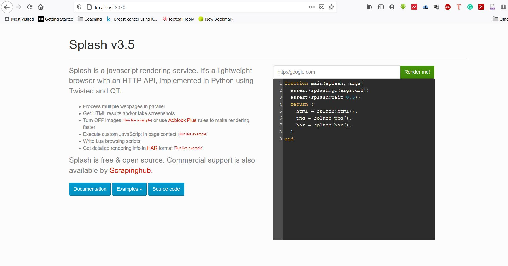
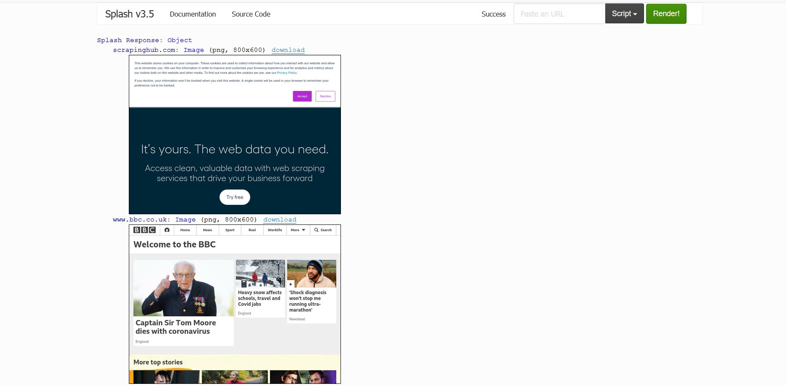

# Practical Test - SE - Python

1. git init
2. touch README.md
3. git commit -m "Empty project with README"
4. git remote add origin https://github.com/zuhthisahan/vdev-20210201
5. git push -u origin main
---------------

## Prepare a Python dev environment

6. Download the python-3.x.x.exe file and install it. After install run this command on terminal to check wheter python is successfully installed or not ("python --version") it wll show the python version.

In order to create a python environment "python -m venv [env_name]" then activate it.

7. Use pip to install packages ex: pip install foobar
8. pip uninstall foobar
9. pip list
10. pycache used to store the program's bytecode. when the script changes, it will be recompiled, and if we delete the files and run the program again, they will appear

11. GIL allows only one thread to hold the control of the python interpreter.

The GIL uses a single lock which adds a rule that execution of a program requires to acquiring the interpreted lock. This prevents Deadlock and aslo doesn't introduce much performance overhead.

## Docker image

## Problems 

In order to extract the details from the requested page, I recives an empty array as repsonse. I think the problem is, after entered the parcel number the url doesn't change according to the dynamic request so i have to find a proper way to pass the requesting url according to the parcel number.
